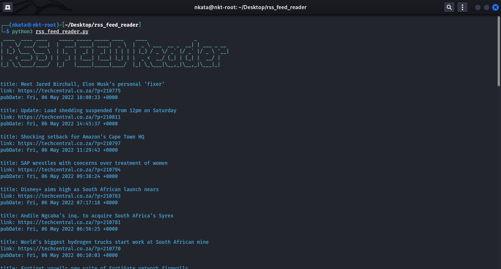

# rss_feed_reader
extract articles, i.e {title, link, published date, description} from RSS feeds to view in a command prompt


## Installation
```
git clone https://github.com/nkatasekonya/rss_feed_reader.git
cd rss_feed_reader
source venv/bin/activate
pip3 install -r requirements.txt
python3 ./rss_feed_reader.py
```

## Usage
- Insert an RSS Feed on line 38 in rss_feed_reader.py 
  - *on a wordpress site, add "/feed" to the end of the URL to access the RSS feed*
```python
feed_links = ["https://techcentral.co.za/feed", "https://ventureburn.com/feed"]
```
- run the script
```python
python3 rss_feed_reader.py
```
- to run on Linux
```bash
chmod u+x rss_feed_reader.py
./rss_feed_reader.py
```
